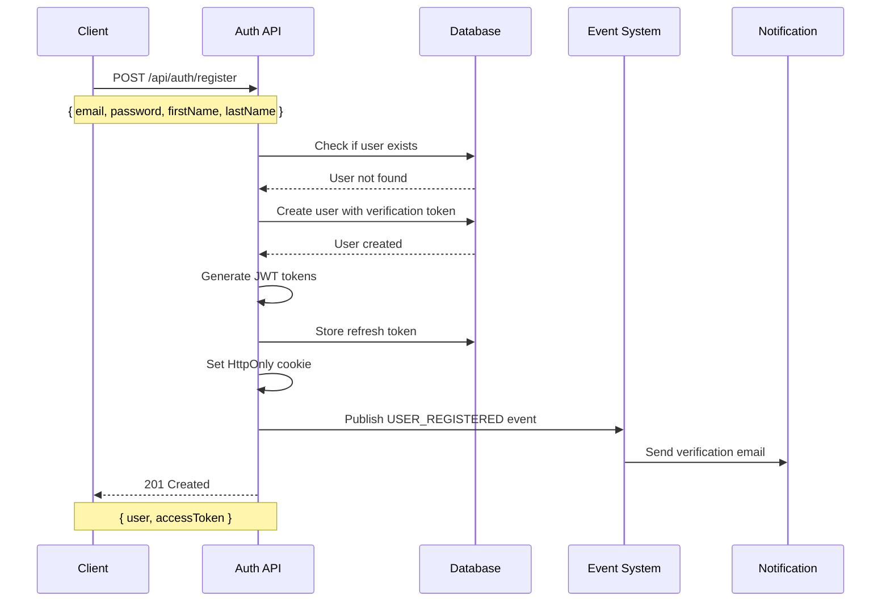
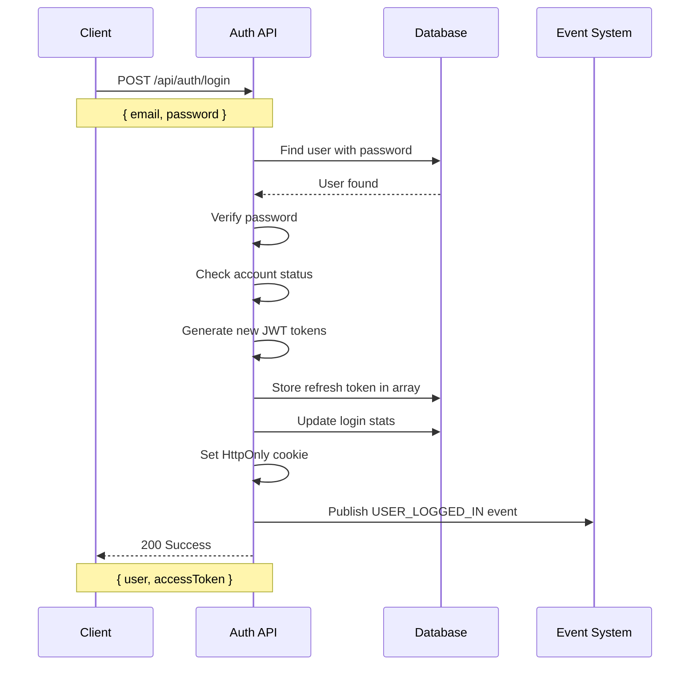
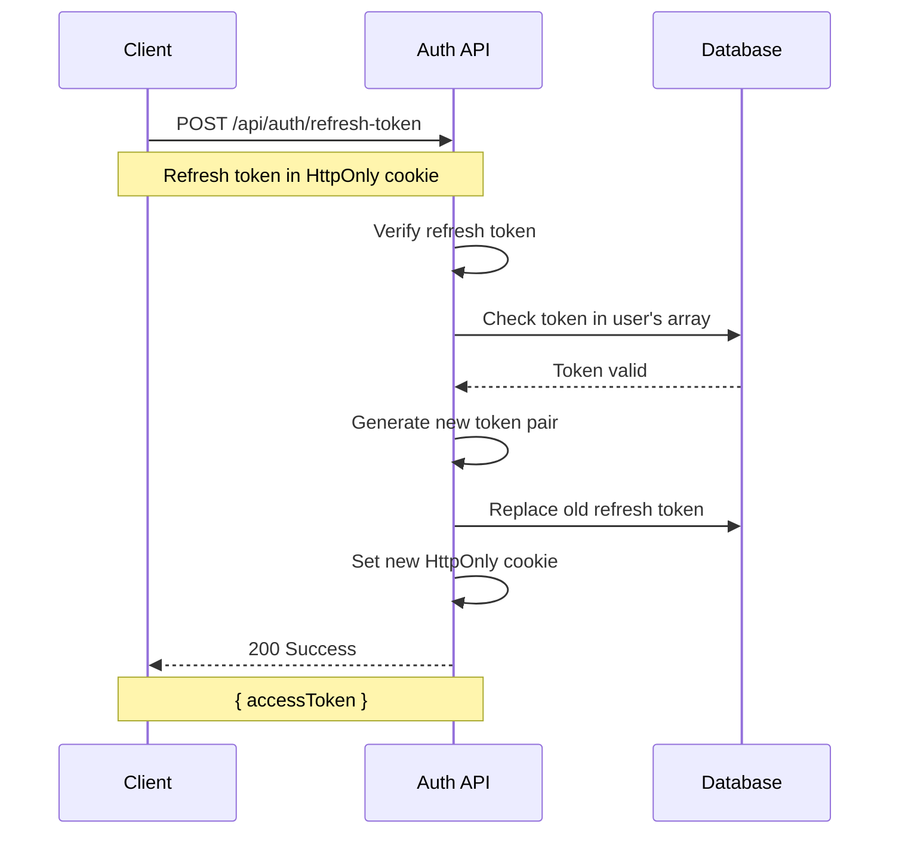
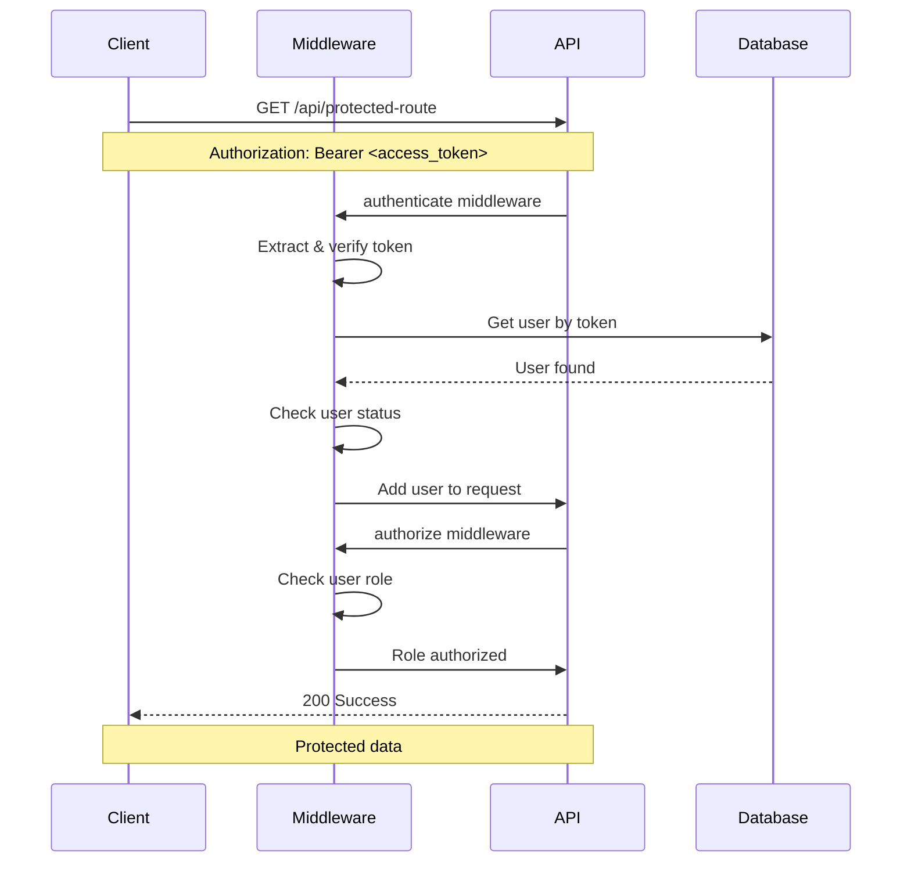
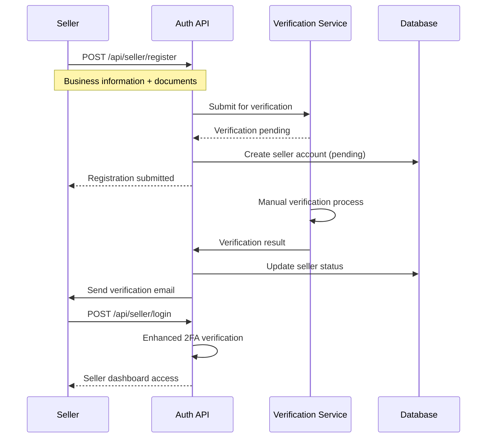

# Authentication Flow Documentation

## Overview

This document describes the comprehensive authentication and authorization system for ShopStream, covering both **Users (Customers)** and **Sellers**. The system uses JWT-based authentication with refresh tokens, role-based access control, and multi-device support.

## Table of Contents

1. [System Architecture](#system-architecture)
2. [User Roles & Permissions](#user-roles--permissions)
3. [Authentication Flow](#authentication-flow)
4. [Token Management](#token-management)
5. [Authorization System](#authorization-system)
6. [Security Features](#security-features)
7. [API Endpoints](#api-endpoints)
8. [Error Handling](#error-handling)
9. [Future Enhancements](#future-enhancements)

---

## System Architecture

### Current Implementation

```
┌─────────────────┐    ┌─────────────────┐    ┌─────────────────┐
│   Client App    │    │   API Gateway   │    │   Auth Service  │
│                 │    │                 │    │                 │
│ • Web Browser   │◄──►│ • Rate Limiting │◄──►│ • JWT Generation│
│ • Mobile App    │    │ • CORS          │    │ • Token Refresh │
│ • Desktop App   │    │ • Validation    │    │ • Role Check    │
└─────────────────┘    └─────────────────┘    └─────────────────┘
         │                       │                       │
         │                       │                       │
         ▼                       ▼                       ▼
┌─────────────────┐    ┌─────────────────┐    ┌─────────────────┐
│   Cookie Store  │    │   Middleware    │    │   Database      │
│                 │    │                 │    │                 │
│ • Refresh Token │    │ • Authentication│    │ • User Data     │
│ • HttpOnly      │    │ • Authorization │    │ • Refresh Tokens│
│ • Secure        │    │ • Rate Limiting │    │ • Device Info   │
└─────────────────┘    └─────────────────┘    └─────────────────┘
```

### Key Components

- **JWT Tokens**: Access tokens (15-30 min) + Refresh tokens (7 days)
- **HttpOnly Cookies**: Secure refresh token storage
- **Role-Based Access Control**: Customer, Seller, Admin roles
- **Multi-Device Support**: Multiple refresh tokens per user
- **Event-Driven Architecture**: Authentication events for analytics

---

## User Roles & Permissions

### Role Hierarchy

```
┌─────────────────┐
│   SUPER_ADMIN   │ ← Highest privileges
│                 │
├─────────────────┤
│     ADMIN       │ ← System administration
│                 │
├─────────────────┤
│   MODERATOR     │ ← Content moderation
│                 │
├─────────────────┤
│     SELLER      │ ← Product management
│                 │
├─────────────────┤
│    CUSTOMER     │ ← Basic user access
│                 │
└─────────────────┘
```

### Current Role Implementation

| Role       | Description           | Default | Permissions                                               |
| ---------- | --------------------- | ------- | --------------------------------------------------------- |
| `customer` | Regular users         | ✅      | • Browse products<br>• Make purchases<br>• Manage profile |
| `seller`   | Product sellers       | ❌      | • Manage products<br>• View analytics<br>• Handle orders  |
| `admin`    | System administrators | ❌      | • User management<br>• System settings<br>• Full access   |

### Role Assignment

```javascript
// User registration (defaults to customer)
const user = await User.create({
  email: "user@example.com",
  password: "SecurePass123!",
  role: "customer", // Default role
});

// Admin can promote users to seller
await User.findByIdAndUpdate(userId, { role: "seller" });
```

---

## Authentication Flow

### 1. User Registration Flow



### 2. User Login Flow



### 3. Token Refresh Flow



### 4. Protected Route Access



---

## Token Management

### Token Types

| Token Type        | Purpose                    | Expiration    | Storage         | Security           |
| ----------------- | -------------------------- | ------------- | --------------- | ------------------ |
| **Access Token**  | API authentication         | 15-30 minutes | Client memory   | Short-lived        |
| **Refresh Token** | Generate new access tokens | 7 days        | HttpOnly cookie | Long-lived, secure |

### Token Structure

```javascript
// Access Token Payload
{
  "userId": "64f1a2b3c4d5e6f7g8h9i0j1",
  "email": "user@example.com",
  "role": "customer",
  "iat": 1699123456,
  "exp": 1699125256,
  "type": "access"
}

// Refresh Token Payload
{
  "userId": "64f1a2b3c4d5e6f7g8h9i0j1",
  "email": "user@example.com",
  "role": "customer",
  "iat": 1699123456,
  "exp": 1699728256,
  "jti": "unique_token_id",
  "type": "refresh"
}
```

### Multi-Device Token Management

```javascript
// User document in database
{
  _id: "64f1a2b3c4d5e6f7g8h9i0j1",
  email: "user@example.com",
  refreshTokens: [
    "eyJhbGciOiJIUzI1NiIsInR5cCI6IkpXVCJ9...", // Mobile device
    "eyJhbGciOiJIUzI1NiIsInR5cCI6IkpXVCJ9...", // Desktop device
    "eyJhbGciOiJIUzI1NiIsInR5cCI6IkpXVCJ9..."  // Tablet device
  ],
  deviceInfo: {
    lastDevice: "iPhone 14",
    lastIP: "192.168.1.100",
    lastUserAgent: "Mozilla/5.0..."
  }
}
```

---

## Authorization System

### Middleware Stack

```javascript
// Route protection example
router.get(
  "/api/seller/products",
  authenticate, // 1. Verify JWT token
  authorize("seller"), // 2. Check user role
  updateLastActive, // 3. Update activity
  checkAccountStatus, // 4. Verify account status
  sellerController.getProducts
);
```

### Role-Based Access Control

```javascript
// Predefined authorization middlewares
const adminOnly = authorize("admin");
const sellerOrAdmin = authorize("seller", "admin");
const customerOnly = authorize("customer", "seller", "admin");

// Usage in routes
router.get(
  "/api/admin/users",
  authenticate,
  adminOnly,
  adminController.getUsers
);
router.get(
  "/api/seller/dashboard",
  authenticate,
  sellerOrAdmin,
  sellerController.getDashboard
);
router.get(
  "/api/profile",
  authenticate,
  customerOnly,
  userController.getProfile
);
```

### Permission System

```javascript
// Role permissions mapping
const ROLE_PERMISSIONS = {
  customer: [
    "read_products",
    "create_order",
    "manage_profile",
    "create_review",
  ],
  seller: [
    "manage_products",
    "view_analytics",
    "handle_orders",
    "manage_inventory",
  ],
  admin: [
    "manage_users",
    "manage_system",
    "view_all_analytics",
    "manage_roles",
  ],
};
```

---

## Security Features

### 1. Token Security

- **HttpOnly Cookies**: Refresh tokens not accessible via JavaScript
- **Secure Cookies**: HTTPS-only in production
- **SameSite Protection**: CSRF attack prevention
- **Token Rotation**: New refresh token on each use

### 2. Account Security

- **Password Hashing**: bcrypt with salt rounds
- **Account Lockout**: 5 failed attempts = 30 min lock
- **Email Verification**: Required for account activation
- **Phone Verification**: Optional for enhanced security

### 3. Rate Limiting

```javascript
// Rate limiting configuration
const authLimiter = rateLimit({
  windowMs: 15 * 60 * 1000, // 15 minutes
  max: 5, // 5 attempts per window
  message: "Too many authentication attempts",
});

const loginLimiter = rateLimit({
  windowMs: 15 * 60 * 1000,
  max: 3, // 3 login attempts per window
  message: "Too many login attempts",
});
```

### 4. Device Tracking

```javascript
// Device information tracking
deviceInfo: {
  lastDevice: String,     // Last device used
  lastIP: String,         // Last IP address
  lastUserAgent: String,  // Last user agent
  lastActiveAt: Date      // Last activity timestamp
}
```

---

## API Endpoints

### Authentication Endpoints

| Method | Endpoint                        | Description            | Access        |
| ------ | ------------------------------- | ---------------------- | ------------- |
| `POST` | `/api/auth/register`            | User registration      | Public        |
| `POST` | `/api/auth/login`               | User login             | Public        |
| `POST` | `/api/auth/logout`              | User logout            | Authenticated |
| `POST` | `/api/auth/refresh-token`       | Refresh access token   | Public        |
| `POST` | `/api/auth/forgot-password`     | Request password reset | Public        |
| `POST` | `/api/auth/reset-password`      | Reset password         | Public        |
| `GET`  | `/api/auth/verify-email/:token` | Verify email           | Public        |
| `POST` | `/api/auth/resend-verification` | Resend verification    | Public        |

### Protected Endpoints

| Method | Endpoint                    | Description      | Required Role |
| ------ | --------------------------- | ---------------- | ------------- |
| `GET`  | `/api/auth/me`              | Get current user | Any           |
| `POST` | `/api/auth/change-password` | Change password  | Any           |
| `GET`  | `/api/seller/dashboard`     | Seller dashboard | Seller/Admin  |
| `GET`  | `/api/admin/users`          | User management  | Admin         |
| `POST` | `/api/seller/products`      | Create product   | Seller/Admin  |

---

## Error Handling

### Authentication Errors

| Error Code | Message                         | Description                     |
| ---------- | ------------------------------- | ------------------------------- |
| `401`      | `Access token is required`      | No token provided               |
| `401`      | `Invalid or expired token`      | Token verification failed       |
| `401`      | `User no longer exists`         | User deleted after token issued |
| `401`      | `Account is deactivated`        | User account disabled           |
| `401`      | `Account is temporarily locked` | Too many failed attempts        |

### Authorization Errors

| Error Code | Message                    | Description                 |
| ---------- | -------------------------- | --------------------------- |
| `403`      | `Insufficient permissions` | Role not authorized         |
| `403`      | `Please verify your email` | Email verification required |
| `403`      | `Please verify your phone` | Phone verification required |

### Rate Limiting Errors

| Error Code | Message                            | Description               |
| ---------- | ---------------------------------- | ------------------------- |
| `429`      | `Too many authentication attempts` | Rate limit exceeded       |
| `429`      | `Too many login attempts`          | Login rate limit exceeded |

---

## Current Implementation Status

### ✅ Implemented Features

- **JWT Authentication**: Access + Refresh tokens
- **Role-Based Access Control**: Customer, Seller, Admin
- **Multi-Device Support**: Multiple refresh tokens
- **HttpOnly Cookies**: Secure token storage
- **Rate Limiting**: Protection against brute force
- **Account Security**: Lockout, verification, hashing
- **Event System**: Authentication events for analytics

### ❌ Missing Features

- **Two-Factor Authentication**: 2FA support
- **Social Login**: Google, Facebook integration
- **Session Management**: Active session tracking
- **Device Management**: Device-specific controls
- **Audit Logging**: Authentication audit trail

---

## Future Enhancements

### 1. Separate Seller Authentication

**Current State**: Sellers use the same authentication system as customers
**Proposed Enhancement**: Dedicated seller authentication with additional security

#### Proposed Seller Auth Features:

```javascript
// Enhanced seller authentication
const sellerAuth = {
  // Additional verification steps
  businessVerification: {
    required: true,
    documents: ["business_license", "tax_id", "bank_account"],
    status: "pending|verified|rejected",
  },

  // Enhanced security
  twoFactorAuth: {
    required: true,
    methods: ["sms", "email", "authenticator"],
  },

  // Seller-specific permissions
  permissions: [
    "manage_products",
    "view_analytics",
    "handle_orders",
    "manage_inventory",
    "access_seller_dashboard",
  ],

  // Compliance features
  compliance: {
    gdprConsent: true,
    dataRetention: "7_years",
    auditLogging: true,
  },
};
```

#### Seller Authentication Flow:



### 2. Enhanced Security Features

- **Biometric Authentication**: Fingerprint, face recognition
- **Hardware Security Keys**: FIDO2/WebAuthn support
- **Risk-Based Authentication**: ML-powered risk assessment
- **Zero-Trust Architecture**: Continuous verification

### 3. Advanced Session Management

- **Session Analytics**: Track user behavior patterns
- **Anomaly Detection**: Detect suspicious activities
- **Geolocation Tracking**: Location-based access control
- **Device Fingerprinting**: Unique device identification

---

## Implementation Recommendations

### 1. Immediate Actions

1. **Add 2FA Support**: Implement TOTP-based two-factor authentication
2. **Enhance Logging**: Add comprehensive audit logging
3. **Session Management**: Implement active session tracking
4. **Device Management**: Add device-specific controls

### 2. Medium-term Goals

1. **Separate Seller Auth**: Create dedicated seller authentication system
2. **Social Login**: Integrate Google, Facebook, Apple Sign-In
3. **Advanced Analytics**: Implement authentication analytics
4. **Compliance Features**: Add GDPR, CCPA compliance tools

### 3. Long-term Vision

1. **Zero-Trust Architecture**: Implement continuous verification
2. **AI-Powered Security**: ML-based threat detection
3. **Blockchain Integration**: Decentralized identity management
4. **Quantum-Safe Cryptography**: Future-proof security

---

## Conclusion

The current authentication system provides a solid foundation with JWT-based authentication, role-based access control, and multi-device support. The system is secure, scalable, and follows industry best practices.

**Key Strengths:**

- ✅ Secure token management
- ✅ Role-based authorization
- ✅ Multi-device support
- ✅ Rate limiting protection
- ✅ Event-driven architecture

**Areas for Improvement:**

- 🔄 Two-factor authentication
- 🔄 Separate seller authentication
- 🔄 Enhanced session management
- 🔄 Social login integration

The proposed enhancements will further strengthen the security posture and provide a better user experience for both customers and sellers.
