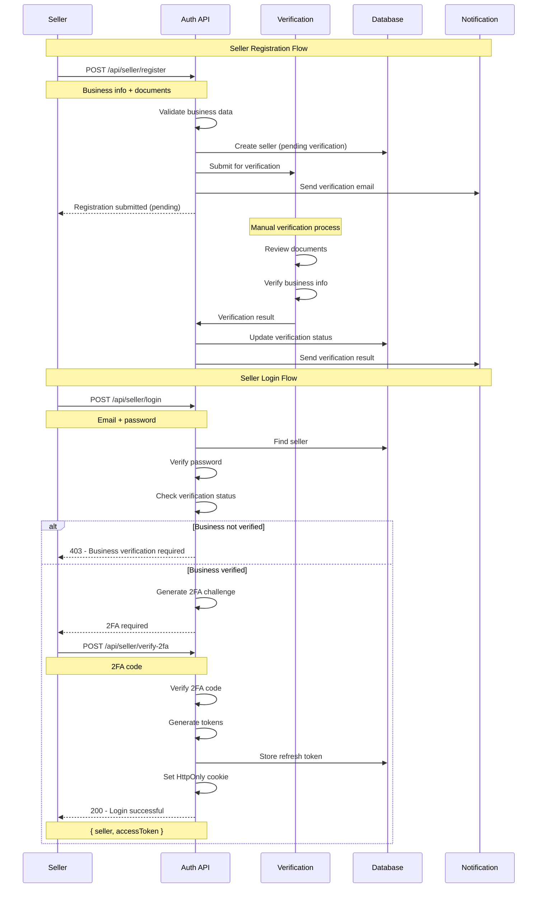

# Seller Authentication System Design

## Overview

This document outlines the design for a separate, enhanced authentication system specifically for sellers. The current system treats sellers as regular users with different roles, but sellers require additional security, verification, and compliance features.

## Table of Contents

1. [Current State Analysis](#current-state-analysis)
2. [Proposed Seller Authentication System](#proposed-seller-authentication-system)
3. [Implementation Architecture](#implementation-architecture)
4. [Security Enhancements](#security-enhancements)
5. [Compliance Features](#compliance-features)
6. [API Design](#api-design)
7. [Database Schema](#database-schema)
8. [Migration Strategy](#migration-strategy)
9. [Implementation Timeline](#implementation-timeline)

---

## Current State Analysis

### Current Implementation

```javascript
// Current seller authentication (same as customer)
const user = {
  _id: "user123",
  email: "seller@example.com",
  password: "hashed_password",
  role: "seller", // Only difference from customer
  isActive: true,
  isEmailVerified: true,
};
```

### Limitations

1. **No Business Verification**: Sellers can register without business validation
2. **Same Security Level**: No enhanced security for business accounts
3. **No Compliance Tracking**: Missing audit trails and compliance features
4. **Limited Permissions**: Basic role-based access without granular controls
5. **No Business Context**: Missing business-specific information

---

## Proposed Seller Authentication System

### Core Principles

1. **Enhanced Security**: Multi-factor authentication and advanced verification
2. **Business Verification**: Document verification and business validation
3. **Compliance Ready**: Audit logging and regulatory compliance
4. **Granular Permissions**: Fine-grained access control
5. **Separate Identity**: Distinct seller identity from customer identity

### System Architecture

```
┌─────────────────┐    ┌─────────────────┐    ┌─────────────────┐
│   Seller App    │    │ Seller Auth API │    │ Verification    │
│                 │    │                 │    │ Service         │
│ • Dashboard     │◄──►│ • Registration  │◄──►│ • Document      │
│ • Product Mgmt  │    │ • Login         │    │   Verification  │
│ • Analytics     │    │ • 2FA           │    │ • Business      │
└─────────────────┘    └─────────────────┘    │   Validation    │
         │                       │             └─────────────────┘
         │                       │                       │
         ▼                       ▼                       ▼
┌─────────────────┐    ┌─────────────────┐    ┌─────────────────┐
│   Seller DB     │    │   Audit Log     │    │   Compliance    │
│                 │    │                 │    │   Engine        │
│ • Business Info │    │ • Login Events  │    │ • GDPR          │
│ • Verification  │    │ • API Calls     │    │ • PCI DSS       │
│ • Permissions   │    │ • Data Changes  │    │ • SOX           │
└─────────────────┘    └─────────────────┘    └─────────────────┘
```

---

## Implementation Architecture

### 1. Separate Seller Model

```javascript
// New Seller model
const sellerSchema = new mongoose.Schema(
  {
    // Business Information
    businessInfo: {
      businessName: { type: String, required: true },
      businessType: {
        type: String,
        enum: ["individual", "partnership", "corporation", "llc"],
        required: true,
      },
      taxId: { type: String, required: true },
      businessLicense: { type: String, required: true },
      businessAddress: {
        street: String,
        city: String,
        state: String,
        zipCode: String,
        country: { type: String, default: "US" },
      },
    },

    // Contact Information
    contactInfo: {
      primaryEmail: { type: String, required: true, unique: true },
      secondaryEmail: String,
      phone: { type: String, required: true },
      website: String,
      socialMedia: {
        facebook: String,
        instagram: String,
        twitter: String,
      },
    },

    // Authentication
    authentication: {
      password: { type: String, required: true, select: false },
      twoFactorEnabled: { type: Boolean, default: true },
      twoFactorSecret: { type: String, select: false },
      backupCodes: [{ type: String, select: false }],
      refreshTokens: [{ type: String, select: false }],
      lastLoginAt: Date,
      loginAttempts: { type: Number, default: 0 },
      accountLockedUntil: Date,
    },

    // Verification Status
    verification: {
      emailVerified: { type: Boolean, default: false },
      phoneVerified: { type: Boolean, default: false },
      businessVerified: {
        type: String,
        enum: ["pending", "verified", "rejected", "suspended"],
        default: "pending",
      },
      documentsVerified: {
        businessLicense: {
          type: String,
          enum: ["pending", "verified", "rejected"],
        },
        taxId: { type: String, enum: ["pending", "verified", "rejected"] },
        bankAccount: {
          type: String,
          enum: ["pending", "verified", "rejected"],
        },
      },
      verificationNotes: String,
      verifiedAt: Date,
      verifiedBy: { type: mongoose.Schema.Types.ObjectId, ref: "Admin" },
    },

    // Permissions & Access
    permissions: {
      canManageProducts: { type: Boolean, default: true },
      canViewAnalytics: { type: Boolean, default: true },
      canHandleOrders: { type: Boolean, default: true },
      canManageInventory: { type: Boolean, default: true },
      canAccessReports: { type: Boolean, default: false },
      canManageTeam: { type: Boolean, default: false },
    },

    // Compliance & Audit
    compliance: {
      gdprConsent: { type: Boolean, default: false },
      dataRetentionPeriod: { type: Number, default: 7 }, // years
      auditLogging: { type: Boolean, default: true },
      lastComplianceCheck: Date,
      complianceStatus: {
        type: String,
        enum: ["compliant", "non_compliant", "pending"],
        default: "pending",
      },
    },

    // Status & Settings
    status: {
      isActive: { type: Boolean, default: false }, // Must be verified first
      isSuspended: { type: Boolean, default: false },
      suspensionReason: String,
      suspensionExpiresAt: Date,
      onboardingCompleted: { type: Boolean, default: false },
    },

    // Analytics & Tracking
    analytics: {
      totalProducts: { type: Number, default: 0 },
      totalOrders: { type: Number, default: 0 },
      totalRevenue: { type: Number, default: 0 },
      lastActivityAt: Date,
      deviceInfo: {
        lastDevice: String,
        lastIP: String,
        lastUserAgent: String,
      },
    },
  },
  {
    timestamps: true,
    toJSON: { virtuals: true },
    toObject: { virtuals: true },
  }
);
```

### 2. Enhanced Authentication Flow



### 3. Two-Factor Authentication

```javascript
// Enhanced 2FA for sellers
const twoFactorAuth = {
  // Required for all sellers
  required: true,

  // Multiple methods supported
  methods: {
    totp: {
      enabled: true,
      secret: "base32_encoded_secret",
      backupCodes: ["code1", "code2", "code3"],
    },
    sms: {
      enabled: true,
      phoneNumber: "+1234567890",
      verified: true,
    },
    email: {
      enabled: true,
      email: "seller@example.com",
      verified: true,
    },
  },

  // Security settings
  settings: {
    backupCodesCount: 10,
    codeExpiry: 300, // 5 minutes
    maxAttempts: 3,
    lockoutDuration: 900, // 15 minutes
  },
};
```

---

## Security Enhancements

### 1. Enhanced Password Policy

```javascript
const sellerPasswordPolicy = {
  minLength: 12,
  requireUppercase: true,
  requireLowercase: true,
  requireNumbers: true,
  requireSpecialChars: true,
  preventCommonPasswords: true,
  preventPersonalInfo: true,
  maxAge: 90, // days
  historyCount: 5, // prevent reuse of last 5 passwords
};
```

### 2. Advanced Rate Limiting

```javascript
const sellerRateLimits = {
  login: {
    windowMs: 15 * 60 * 1000, // 15 minutes
    max: 3, // 3 attempts
    blockDuration: 30 * 60 * 1000, // 30 minutes
  },
  registration: {
    windowMs: 60 * 60 * 1000, // 1 hour
    max: 1, // 1 registration per hour
    blockDuration: 24 * 60 * 60 * 1000, // 24 hours
  },
  api: {
    windowMs: 15 * 60 * 1000, // 15 minutes
    max: 1000, // 1000 requests
    blockDuration: 60 * 60 * 1000, // 1 hour
  },
};
```

### 3. Session Management

```javascript
const sessionManagement = {
  // Active session tracking
  activeSessions: [
    {
      sessionId: "unique_session_id",
      deviceInfo: {
        device: "iPhone 14",
        browser: "Safari",
        os: "iOS 16.0",
        ip: "192.168.1.100",
      },
      loginAt: "2024-01-15T10:00:00Z",
      lastActivity: "2024-01-15T11:30:00Z",
      isActive: true,
    },
  ],

  // Session controls
  maxConcurrentSessions: 3,
  sessionTimeout: 8 * 60 * 60 * 1000, // 8 hours
  idleTimeout: 30 * 60 * 1000, // 30 minutes

  // Security features
  deviceFingerprinting: true,
  ipWhitelisting: false,
  geolocationTracking: true,
};
```

---

## Compliance Features

### 1. Audit Logging

```javascript
const auditLogSchema = new mongoose.Schema({
  sellerId: {
    type: mongoose.Schema.Types.ObjectId,
    ref: "Seller",
    required: true,
  },
  action: { type: String, required: true }, // 'login', 'logout', 'data_access', etc.
  resource: String, // 'products', 'orders', 'analytics'
  details: {
    ip: String,
    userAgent: String,
    device: String,
    location: {
      country: String,
      city: String,
      coordinates: [Number, Number],
    },
  },
  timestamp: { type: Date, default: Date.now },
  success: Boolean,
  errorMessage: String,
});
```

### 2. Data Privacy

```javascript
const dataPrivacy = {
  // GDPR Compliance
  gdpr: {
    consentGiven: true,
    consentDate: "2024-01-15T10:00:00Z",
    dataProcessingPurposes: [
      "account_management",
      "order_processing",
      "analytics",
      "marketing",
    ],
    dataRetentionPeriod: 7, // years
    rightToErasure: true,
    dataPortability: true,
  },

  // Data encryption
  encryption: {
    atRest: "AES-256",
    inTransit: "TLS 1.3",
    keyManagement: "AWS KMS",
  },

  // Data access controls
  accessControls: {
    roleBasedAccess: true,
    attributeBasedAccess: true,
    timeBasedAccess: true,
    locationBasedAccess: false,
  },
};
```

---

## API Design

### Seller Authentication Endpoints

```javascript
// Registration & Verification
POST   /api/seller/register              // Register new seller
POST   /api/seller/verify-email          // Verify email address
POST   /api/seller/resend-verification   // Resend verification email
POST   /api/seller/upload-documents      // Upload business documents
GET    /api/seller/verification-status   // Check verification status

// Authentication
POST   /api/seller/login                 // Login with 2FA
POST   /api/seller/logout                // Logout
POST   /api/seller/refresh-token         // Refresh access token
POST   /api/seller/verify-2fa            // Verify 2FA code
POST   /api/seller/resend-2fa            // Resend 2FA code

// Password Management
POST   /api/seller/forgot-password       // Request password reset
POST   /api/seller/reset-password        // Reset password
POST   /api/seller/change-password       // Change password
GET    /api/seller/password-policy       // Get password policy

// Session Management
GET    /api/seller/sessions              // Get active sessions
DELETE /api/seller/sessions/:id          // Terminate specific session
DELETE /api/seller/sessions/all          // Terminate all sessions

// Security
GET    /api/seller/security-events       // Get security events
POST   /api/seller/enable-2fa            // Enable 2FA
POST   /api/seller/disable-2fa           // Disable 2FA
GET    /api/seller/backup-codes          // Get backup codes
POST   /api/seller/regenerate-codes      // Regenerate backup codes

// Profile & Settings
GET    /api/seller/profile               // Get seller profile
PUT    /api/seller/profile               // Update seller profile
GET    /api/seller/permissions           // Get seller permissions
PUT    /api/seller/notifications         // Update notification settings
```

### Request/Response Examples

```javascript
// Seller Registration Request
POST /api/seller/register
{
  "businessInfo": {
    "businessName": "Tech Solutions LLC",
    "businessType": "llc",
    "taxId": "12-3456789",
    "businessLicense": "BL-2024-001",
    "businessAddress": {
      "street": "123 Business St",
      "city": "New York",
      "state": "NY",
      "zipCode": "10001",
      "country": "US"
    }
  },
  "contactInfo": {
    "primaryEmail": "seller@techsolutions.com",
    "phone": "+1234567890",
    "website": "https://techsolutions.com"
  },
  "authentication": {
    "password": "SecurePassword123!"
  }
}

// Seller Registration Response
{
  "success": true,
  "data": {
    "sellerId": "64f1a2b3c4d5e6f7g8h9i0j1",
    "verificationStatus": "pending",
    "nextSteps": [
      "Check your email for verification link",
      "Upload required business documents",
      "Wait for manual verification (1-3 business days)"
    ]
  },
  "message": "Seller registration submitted successfully"
}

// Seller Login Request
POST /api/seller/login
{
  "email": "seller@techsolutions.com",
  "password": "SecurePassword123!"
}

// Seller Login Response (2FA Required)
{
  "success": true,
  "data": {
    "requires2FA": true,
    "methods": ["totp", "sms", "email"],
    "challengeId": "challenge_123"
  },
  "message": "2FA verification required"
}

// 2FA Verification Request
POST /api/seller/verify-2fa
{
  "challengeId": "challenge_123",
  "method": "totp",
  "code": "123456"
}

// 2FA Verification Response
{
  "success": true,
  "data": {
    "seller": {
      "id": "64f1a2b3c4d5e6f7g8h9i0j1",
      "businessName": "Tech Solutions LLC",
      "verificationStatus": "verified",
      "permissions": ["manage_products", "view_analytics"]
    },
    "accessToken": "eyJhbGciOiJIUzI1NiIsInR5cCI6IkpXVCJ9...",
    "sessionId": "session_456"
  },
  "message": "Login successful"
}
```

---

## Database Schema

### Seller Collection

```javascript
// MongoDB Collection: sellers
{
  _id: ObjectId("64f1a2b3c4d5e6f7g8h9i0j1"),

  // Business Information
  businessInfo: {
    businessName: "Tech Solutions LLC",
    businessType: "llc",
    taxId: "12-3456789",
    businessLicense: "BL-2024-001",
    businessAddress: {
      street: "123 Business St",
      city: "New York",
      state: "NY",
      zipCode: "10001",
      country: "US"
    }
  },

  // Contact Information
  contactInfo: {
    primaryEmail: "seller@techsolutions.com",
    secondaryEmail: "admin@techsolutions.com",
    phone: "+1234567890",
    website: "https://techsolutions.com",
    socialMedia: {
      facebook: "https://facebook.com/techsolutions",
      instagram: "https://instagram.com/techsolutions"
    }
  },

  // Authentication
  authentication: {
    password: "$2b$12$hashed_password",
    twoFactorEnabled: true,
    twoFactorSecret: "JBSWY3DPEHPK3PXP",
    backupCodes: ["12345678", "87654321", "11223344"],
    refreshTokens: ["eyJhbGciOiJIUzI1NiIsInR5cCI6IkpXVCJ9..."],
    lastLoginAt: ISODate("2024-01-15T10:00:00Z"),
    loginAttempts: 0,
    accountLockedUntil: null
  },

  // Verification Status
  verification: {
    emailVerified: true,
    phoneVerified: true,
    businessVerified: "verified",
    documentsVerified: {
      businessLicense: "verified",
      taxId: "verified",
      bankAccount: "verified"
    },
    verificationNotes: "All documents verified successfully",
    verifiedAt: ISODate("2024-01-10T14:30:00Z"),
    verifiedBy: ObjectId("admin_user_id")
  },

  // Permissions
  permissions: {
    canManageProducts: true,
    canViewAnalytics: true,
    canHandleOrders: true,
    canManageInventory: true,
    canAccessReports: false,
    canManageTeam: false
  },

  // Compliance
  compliance: {
    gdprConsent: true,
    dataRetentionPeriod: 7,
    auditLogging: true,
    lastComplianceCheck: ISODate("2024-01-15T09:00:00Z"),
    complianceStatus: "compliant"
  },

  // Status
  status: {
    isActive: true,
    isSuspended: false,
    suspensionReason: null,
    suspensionExpiresAt: null,
    onboardingCompleted: true
  },

  // Analytics
  analytics: {
    totalProducts: 25,
    totalOrders: 150,
    totalRevenue: 50000,
    lastActivityAt: ISODate("2024-01-15T11:30:00Z"),
    deviceInfo: {
      lastDevice: "MacBook Pro",
      lastIP: "192.168.1.100",
      lastUserAgent: "Mozilla/5.0 (Macintosh; Intel Mac OS X 10_15_7)"
    }
  },

  createdAt: ISODate("2024-01-08T10:00:00Z"),
  updatedAt: ISODate("2024-01-15T11:30:00Z")
}
```

### Audit Log Collection

```javascript
// MongoDB Collection: seller_audit_logs
{
  _id: ObjectId("audit_log_id"),
  sellerId: ObjectId("64f1a2b3c4d5e6f7g8h9i0j1"),
  action: "login",
  resource: "authentication",
  details: {
    ip: "192.168.1.100",
    userAgent: "Mozilla/5.0 (Macintosh; Intel Mac OS X 10_15_7)",
    device: "MacBook Pro",
    location: {
      country: "US",
      city: "New York",
      coordinates: [-74.006, 40.7128]
    }
  },
  timestamp: ISODate("2024-01-15T10:00:00Z"),
  success: true,
  errorMessage: null
}
```

---

## Migration Strategy

### Phase 1: Preparation (Week 1-2)

1. **Database Design**

   - Create new `sellers` collection
   - Design audit logging schema
   - Set up verification workflow

2. **API Development**
   - Implement seller registration endpoints
   - Create verification service
   - Build 2FA system

### Phase 2: Core Implementation (Week 3-4)

1. **Authentication System**

   - Implement seller login/logout
   - Add 2FA verification
   - Create session management

2. **Verification System**
   - Document upload functionality
   - Manual verification workflow
   - Status tracking system

### Phase 3: Security & Compliance (Week 5-6)

1. **Security Features**

   - Enhanced password policies
   - Rate limiting
   - Audit logging

2. **Compliance Features**
   - GDPR compliance
   - Data privacy controls
   - Audit trail

### Phase 4: Testing & Deployment (Week 7-8)

1. **Testing**

   - Unit tests
   - Integration tests
   - Security testing

2. **Deployment**
   - Staging deployment
   - Production deployment
   - Monitoring setup

### Migration Plan for Existing Sellers

```javascript
// Migration script for existing sellers
const migrateExistingSellers = async () => {
  const existingSellers = await User.find({ role: "seller" });

  for (const user of existingSellers) {
    const seller = new Seller({
      // Map existing user data
      contactInfo: {
        primaryEmail: user.email,
        phone: user.phone,
      },
      authentication: {
        password: user.password,
        twoFactorEnabled: false,
        refreshTokens: user.refreshTokens,
      },
      verification: {
        emailVerified: user.isEmailVerified,
        phoneVerified: user.isPhoneVerified,
        businessVerified: "pending", // Require re-verification
      },
      status: {
        isActive: user.isActive,
        onboardingCompleted: false, // Require onboarding
      },
    });

    await seller.save();

    // Update references
    await Product.updateMany({ seller: user._id }, { seller: seller._id });
  }
};
```

---

## Implementation Timeline

### Week 1-2: Foundation

- [ ] Database schema design
- [ ] API endpoint planning
- [ ] Security requirements analysis

### Week 3-4: Core Development

- [ ] Seller model implementation
- [ ] Registration/verification system
- [ ] Basic authentication flow

### Week 5-6: Security & Compliance

- [ ] 2FA implementation
- [ ] Audit logging system
- [ ] Compliance features

### Week 7-8: Testing & Deployment

- [ ] Comprehensive testing
- [ ] Security audit
- [ ] Production deployment

### Week 9-10: Migration & Monitoring

- [ ] Existing seller migration
- [ ] Performance monitoring
- [ ] User feedback collection

---

## Benefits of Separate Seller Authentication

### 1. Enhanced Security

- **Multi-factor authentication** for all sellers
- **Advanced password policies** for business accounts
- **Session management** with device tracking
- **Audit logging** for compliance

### 2. Business Verification

- **Document verification** for business legitimacy
- **Manual review process** for quality control
- **Status tracking** for verification progress
- **Compliance monitoring** for regulatory requirements

### 3. Granular Permissions

- **Fine-grained access control** based on business needs
- **Role-based permissions** for team management
- **Resource-specific access** for different features
- **Time-based access** for security

### 4. Compliance Ready

- **GDPR compliance** for data privacy
- **Audit trails** for regulatory requirements
- **Data retention policies** for business records
- **Security monitoring** for threat detection

### 5. Better User Experience

- **Streamlined onboarding** for new sellers
- **Clear verification status** and next steps
- **Enhanced dashboard** with business context
- **Dedicated support** for seller-specific issues

---

## Conclusion

The separate seller authentication system provides a robust, secure, and compliant solution for managing seller accounts. It addresses the unique needs of business users while maintaining the highest security standards and regulatory compliance.

**Key Benefits:**

- ✅ Enhanced security with 2FA and advanced policies
- ✅ Business verification and compliance features
- ✅ Granular permissions and access control
- ✅ Comprehensive audit logging and monitoring
- ✅ Better user experience for sellers

**Implementation Approach:**

- 🔄 Phased rollout to minimize disruption
- 🔄 Comprehensive testing and security audit
- 🔄 Migration strategy for existing sellers
- 🔄 Continuous monitoring and improvement

This system will provide a solid foundation for scaling the seller platform while maintaining security and compliance standards.
